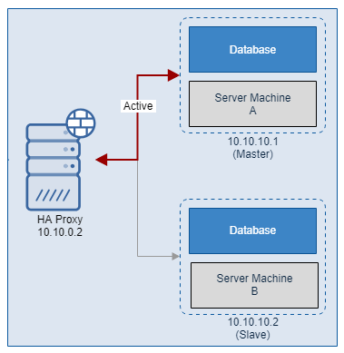
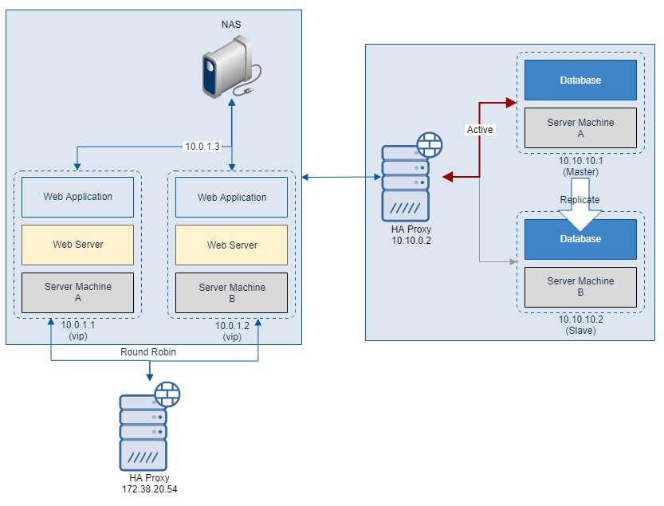
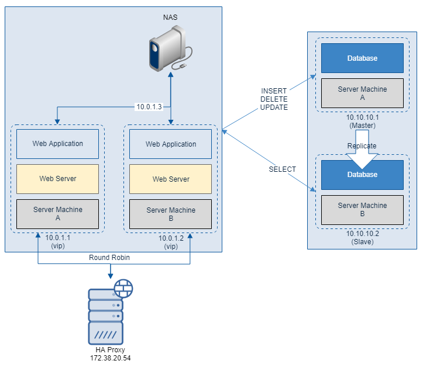

# Database 이중화 구성

* Database 이중화를 하는 것은 조금 까다로운 작업입니다.
* Database 이중화는 지금까지 검토하였던 방식인 L4 Switch 및 HA Proxy 로 이중화를 하는 것은 동일합니다. 
* 하지만 Database 이중화는 Round Robin 방식이 아닌 Master / Slave(또는 Standby) 방식을 사용해야 합니다.
* 이 때 가장 중요한 기능이 Health Check 기능입니다. 특히 TCP 로 Health Check 가 가능해야 합니다. 
* 직접적으로 Database 가 살아있는지 TCP 를 통해 확인해야 하기 때문입니다.
* 예를들면 PostgreSQL 은 5432 포트를 사용하는데, 5432 포트로 Database 에 접근이 가능한지 확인해야 합니다.
  

### 하지만 Database 는 물리적으로 분리되어 있습니다.

* 만약 A 라는 사용자가 웹 서버를 통해 새로운 데이터를 저장하였습니다.
* 그 데이터는 Master Database 에 저장이 되었을 것입니다.
* 그러다가 Master Database 가 장애(fail)이 발생하면, 
* HA Proxy 는 Slave Database 로 접속 시도할 것입니다.
* 이 때 A 라는 사용자가 입력한 데이터는 Slave Database 에 없으므로 찾을 수 없습니다.

### 이 때 NAS 를 사용한다?

* 만약 Database 이중화를 위해 NAS 를 사용한다고 해봅시다.
* NAS 장치에 Data 를 Insert, Delete, Update, Select 한다고 했을 때 무슨 일이 벌어질까요?
* Network Access 를 통해 Data 를 쓰기/읽기를 하게 될텐데, Database 의 성능을 좌우하는 가장 큰 요인은 Disk I/O 인데, 여기에 Network Access 를 통해 Disk I/O 를 한다면 더더욱 손실이 클 것입니다.

### Database Replication(복제)

* 그래서 Database 이중화가 까다로운 것입니다. 
* 이를 해결하는 방법이 바로 Database Replication 이며, 각 Vendor 사들이 자신들의 방식으로 지원하고 있습니다.
* Replication 이란 복제를 말하며, Master Database 에 쓰여진 데이터를 Slave Database 에 그대로 복제하는 것을 의미합니다.
* Replicate 하는 방식은 대부분 Master Database 에 변경된 데이터(Insert/Delete/Update) 의 Transaction Log 를 Slave Database 에 전달하여 그 Transaction Log 를 토대로 Master Database 와 동일한 데이터를 구성하는 방식입니다.

### 최종적으로 보면 다음과 같습니다.

## 하지만 생각을 해봅시다..

* 단가가 높은 SQL Server 나 Oracle 서버를 Master - Slave 로 구축하여 Slave Database 는 장애 발생 시, Failover 를 위해 그냥 놔둔다면 손해일 것입니다.  
* 특히 Database 서버는 기본적으로 최고사양을 사용할 것입니다. CPU / Memory 자원 손실이 어마어마할 것입니다.
* 따라서 대부분 Database Replication 시, Master - Slave 형태가 아닌 Operation 별로 처리할 수 있도록 다음과 같은 형태로 구축합니다.  
  

### Database 이중화 구성의 수 많은 형태

* 하지만 위 그림 처럼 구축하는 것이 제일의 방식은 아닙니다. Database 이중화 구성은 각각의 업체 환경에 따라 천차만별이며, 이중화 구성하는 것이 오히려 독이 될 수 있는 업체도 있을 것입니다.
* 다음 [Article](https://www.brianstorti.com/replication/)은 다양한 형태의 Database 이중화 구성을 잘 설명해 놓았습니다. 

# 마치며

* 지금까지 On-premise 환경에서 웹 서버를 구축하기 위한 네트워크 망 분리, HA 구성, Database 이중화에 대해서 알아보았습니다.
* 그렇다면 Cloud 환경은 어떤 기술 Stack 으로 이루어졌는지 [다음 챕터](../Docker/Readme.md)에서 알아보겠습니다.