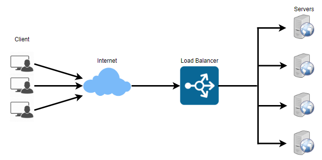
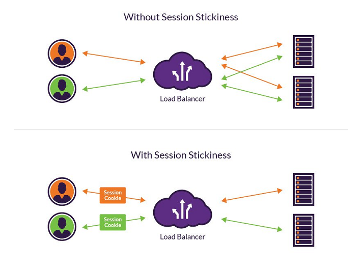
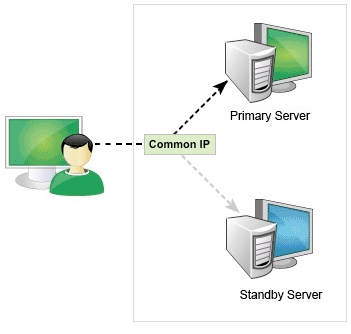

# HA(High Availability) 

* HA(High Availability) 는 고가용성이라고도 불립니다. 고가용성이란 절대 죽지 않는 것을 말합니다.
* HA 를 구성하는 방법 중 가장 기본적인 것이 이중화(Duplication)입니다.

## 이중화

* 이중화는 서버 두 대를 동시에 서비스할 수 있고(HOT),  
  한 대만 서비스하다가 장애 발생 시, 여분의 서버가 동작하게 하는 방법(COLD)이 있습니다.
* 이중화를 구현하기 위해서는 Load Balancer, Failover 등의 용어를 알아야 합니다.

#### Load Balancer

* 로드 밸런서는 부하(트래픽)를 분산시켜주는 역할을 합니다.
* 부하를 분산시키는 방식은 대게 Round Robin 으로 분산시켜 줍니다.
  

#### Sticky Session

* 위 그림과 같이 4 대의 서버를 Round Robin 으로 로드 밸런싱하고 있다고 합시다.
* A 란 사용자가 첫 번째 서버로 접속하여 로그인 하였고, 
* 어떤 물건을 구입할 때 두 번째 서버에서 처리된다고 하였을 때
* 그 세션을 공유하지 않는다면 두 번째 서버에서는 로그인한 것을 알 수가 없을 것입니다.
* 이러한 현상을 해결하기 위해 Sticky Session 을 사용합니다.
* Sticky Session 은 A 란 사용자가 첫 번째 서버로 접속하였다면 물건을 구입할 때도 첫 번째 서버에서 작업이 이루어지도록 처리하는 것을 말합니다.
  

#### Failover

* Failover 는 장애 극복이라고도 불립니다.
* Faileover 는 서버, 시스템, 네트워크 등에서 장애가 발생했을 때, 예비 시스템으로 자동전환되는 것을 말합니다.
  

#### Health Check

* Health Check 는 Load Balancer 에 묶여 있는 시스템이 살아있는지(alive) 체크하는 기능을 말합니다.
* Health Check 하는 방법으로는 Ping 과 같은 방식으로 직접 시스템이 살아있는지 확인하는 방법이 있고,
* 웹 서버인 경우 간단한 HTTP GET 메소드를 호출함으로써 Health Check 하는 방법이 있습니다.
* 위 두 가지 방법이 안되는 환경이라면, TCP Socket 서버/클라이언트로 구현하기도 합니다.

# HA 구성

* HA 를 구성하는 방식에는 크게 두 가지가 있습니다.  
  첫 번째는 물리적으로 HA 구성하는 방식이 있고, 두 번째는 어플리케이션 단위를 HA 구성하는 방식이 있습니다.

* [다음 페이지](웹&#32;서버&#32;이중화&#32;구성&#32;-&#32;L4&#32;switch.md)에서 L4 Switch 로 Web Server 를 이중화하는 방법에 대해 알아보겠습니다.