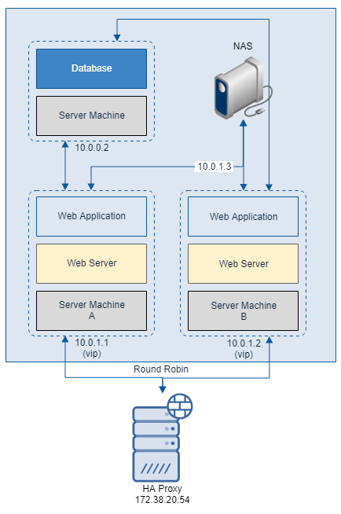

# NAS(Network Attached Storage)를 통한 파일 관리

* NAS는 여러 컴퓨터에서 네트워크를 통해 파일을 저장할 수 있는 장치입니다.
* 또한 OS 에 상관 없이 파일을 저장할 수 있으므로 업체에서 많이 사용하는 장치이기도 합니다.
  

### 이중화 Web Application 에 NAS 를 적용

* 아래는 HA Proxy 로 이중화한 Web Application 을 NAS 를 적용한 모습입니다.

  

# Database 이중화

* [다음 페이지](DB&#32;서버&#32;이중화&#32;구성.md)에서는 Database 를 이중화하는 방법에 대해 알아보겠습니다.