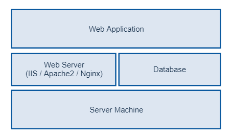

# On-premise 환경에서 서버 운영

* On-premise(온프레미스)란 소프트웨어 등 솔루션을 클라우드 환경이 아닌 자체적으로 보유한 전산실 서버에 직접 설치해 운영하는 방식을 말합니다.

## 목표

* On-premise 환경에서 웹 서버를 어떤 방식으로 구성하는지 알아보겠습니다.

### 웹 서버 구성

* 일반적으로 웹 서버를 구성하면 다음과 같이 서버 시스템에 웹 서버, 데이터베이스, 웹 어플리케이션을 설치 및 운영하게 됩니다.

  

### Server Machine

* Server Machine 은 Windows Server, Ubuntu, CentOS 등의 OS 가 설치된 물리적 환경을 말합니다.

### Web Server

* Web Server 는 IIS, Apache2, Nginx, Jeus 와 같은 제품이 있으며, 웹 호스팅을 하기 위한 어플리케이션입니다.

### Database

* SQL Server, MySQL, Oracle, PostgreSQL 등의 데이터베이스를 말하며, 웹 어플리케이션에 필요한 데이터 등을 저장하는 역할을 합니다.

### Web Application

* ASP.NET, .NET Core Web API, JSP, PHP 등으로 구현된 웹 어플리케이션입니다.

# DB 서버 분리

* 일반적으로 1대의 Server Machine 에 Database 및 웹 서버를 구성하기는 하나, 성능을 향상시키기 위해 Database 서버를 따로 분리합니다.

* 웹 서버 DB 서버 분리는 [다음 페이지](웹&#32;서버&#32;DB&#32;서버&#32;분리.md)에서 다루겠습니다.