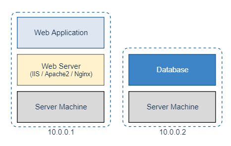
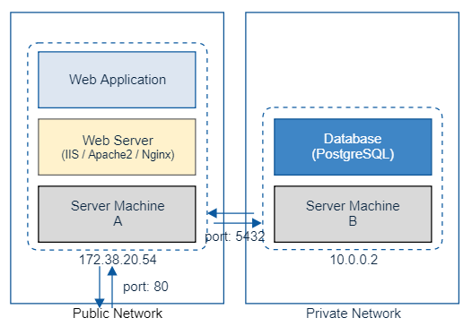

# Web Server / Database Server 분리

* 대게 웹 서버와 Database 서버를 분리합니다.
* 이를 통해 성능 향상을 할 수 있는데, 그 이유는 웹 서버 및 Database 서버가 각각 Server Machine 의 자원(CPU/Memory)를 사용하기 때문입니다.

  

* 여기서 또 하나 얻을 수 있는 이점은 웹 서버는 Public Network 에서 운영하고, Database 서버는 Private Network 에서 운영할 수 있다는 것입니다.

# 네트워크 망 분리

* Web Application 은 기본적으로 모든 사람이 접근할 수 있어햐 하기 때문에 Public Network 망에서 운영을 합니다. 하지만 이는 보안상 취약할 수 밖에 없을 것입니다.
* 따라서 Database Server 를 분리하여, Database 는 Private Network 에 운영하는 것이 Infra 를 구축하는 데 있어서 기본적으로 해야될 사항일 것입니다.

  

# HA 구성

* 그렇다면 Infra 를 구축할 때, 네트워크 망을 분리했다고 끝일까요?

* 만약 웹 서버에 장애가 발생해서 그 장애를 해결할때까지 해당 웹 서버를 사용하지 못한다면 손실이 클 것입니다.

* 좀 더 안정적인 Infra 를 구축하기 위해 해야될 것이 있습니다.

* [다음 페이지](HA&#32;구성.md)에서 HA(High Availability)가 무엇인지 알아보겠습니다.