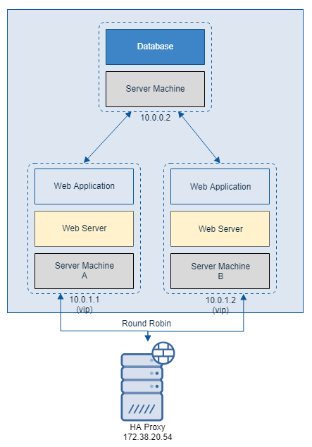

# 웹 서버 HA 구성 - HA Proxy

* 어플리케이션으로 이중화할 수 있는 대표적인 솔루션이 바로 HA Proxy 입니다.
* 또한 HA Proxy 는 무료로 사용할 수 있으며, 리눅스, 윈도우에서 사용가능합니다.

### HA Proxy 특징

* HA Proxy 는 기본적으로 Reverse proxy 방식으로 로드 밸런싱 기능을 제공합니다.
* 또한 Failover 구성 시 필요한 Health Check 기능을 가지고 있습니다.
* HTTP 뿐만 아니라 TCP, HTTPS 를 지원합니다.

## HA Proxy 를 통한 HA 구성 방안 - 1

* HA Proxy 를 사용하면, 하나의 Server Machine 에서 두 개 이상의 Web Application 을 이중화할 수 있습니다.
  

## HA Proxy 를 통한 HA 구성 방안 - 2

* 다음과 같이 L4 Switch 와 동일하게 구성할 수 있습니다.
  

# NAS 를 통한 파일 통합 관리

* 지금까지 L4 Switch 나 HA Proxy 를 통하여 Web Application 을 이중화 구성하는 방법에 대해 알아보았습니다.
* Web Application 이중화 시, 한 가지 문제가 발생하게 됩니다.
* 예를 들어 Web Application 을 통한 파일 업로드 기능이 있다면,  
  Server Machine A 와 Server Machine B 에 업로드한 파일이 각각의 하드 디스크에 따로 저장될 것입니다.
* 이를 해결할 수 있는 방안은 NAS 를 이용하는 방법이 있습니다.
* [다음 페이지](NAS를&#32;통한&#32;파일&#32;관리.md)에서는 NAS 에 대해 알아보겠습니다.