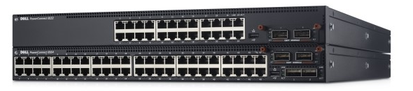
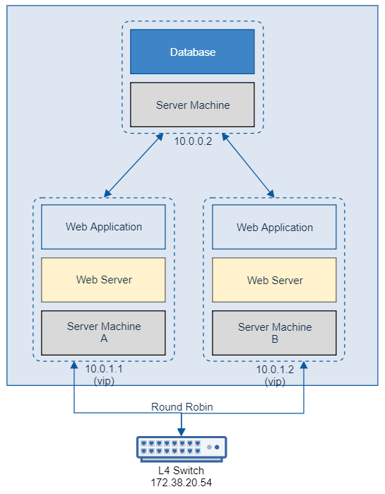

# 웹 서버 HA 구성 - L4 Switch

### L4 Switch

* L4 스위치는 TCP/UDP 프로토콜에서 스위칭을 수행하므로 TCP 와 UDP 포트를 보고 적절한 서버로 패킷을 전송하는 역할을 합니다.
* L4 Switch 내 VIP(Virtual IP) 를 통해 로드밸런싱을 수행합니다.
* 또한 Heal Check 를 통해 Failover 기능을 수행할 수 있습니다.
  

### L4 Switch 를 통한 웹 서버 HA 구성

* L4 Switch 를 통해 Server Machine 을 이중화하면 다음과 같은 구성을 가질 수 있습니다.
  

### 하지만

* L4 Switch 를 On-premise 환경에 적용하기 위해서는 비용이 발생하게 됩니다.

# HAProxy 를 통하 HA 구성

* L4 Switch 는 물리적인 시스템을 이중화하는 방식입니다.
* [다음 페이지](웹&#32;서버&#32;이중화&#32;구성&#32;-&#32;HAProxy.md)에서는 HAProxy 를 사용하여 어플리케이션 층에서 이중화하는 것에 대해 알아보겠습니다.